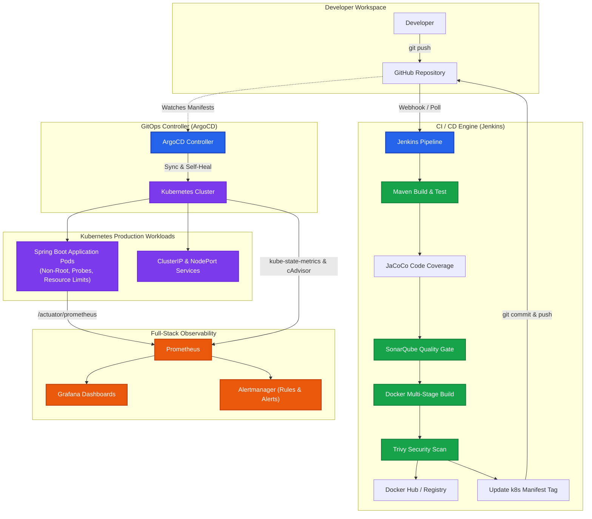

# Cloud-Native DevOps & GitOps Platform on Kubernetes

[](https://www.oracle.com/java/)
[](https://spring.io/projects/spring-boot)
[](https://www.docker.com/)
[](https://kubernetes.io/)
[](https://www.jenkins.io/)
[](https://www.sonarqube.org/)
[](https://argo-cd.readthedocs.io/)
[](https://prometheus.io/)
[](https://grafana.com/)

An enterprise-grade, end-to-end DevOps and GitOps platform featuring automated CI/CD pipelines, static code analysis, container vulnerability scanning, declarative Kubernetes deployments with zero-downtime rolling updates, GitOps continuous reconciliation, and full-stack observability.

---

## Architecture Overview



---

## Key Highlights

- **Automated CI/CD Pipeline**: 12-stage declarative Jenkins pipeline managing build lifecycle, automated test reporting, and artifact management.
- **Shift-Left Security & Code Quality**: SonarQube static analysis with strict Quality Gates and Trivy container vulnerability scanning for high/critical CVEs.
- **GitOps Continuous Delivery**: ArgoCD continuously reconciles cluster state against Git manifests with automated drift detection and self-healing.
- **Hardened Kubernetes Architecture**: Multi-stage non-root container images, rolling zero-downtime updates (`maxSurge: 1, maxUnavailable: 0`), startup/liveness/readiness probes, and resource quotas.
- **Full-Stack Observability**: In-cluster Prometheus scraping Micrometer metrics, `kube-state-metrics`, `cAdvisor`, and `node-exporter`, backed by pre-provisioned Grafana dashboards and Alertmanager rules.
- **Zero Cloud Cost / Fully Self-Contained**: Operates locally on Docker Desktop / Minikube or scales directly to cloud environments (AWS EKS, GKE, AKS).

---

## Technology Stack

| Domain | Technology | Purpose |
|---|---|---|
| **Application** | Java 17, Spring Boot 3, Maven | REST API with Micrometer metrics and health actuators |
| **Testing & Coverage** | JUnit 5 | Automated unit testing and code coverage reporting |
| **Code Quality** | SonarQube Community Edition | Static code analysis, bugs, security vulnerabilities, quality gate |
| **Containerization** | Docker | Multi-stage, minimal attack surface, non-root execution |
| **CI Automation** | Jenkins | Orchestration of testing, quality checks, build, and deployment |
| **Container Orchestration** | Kubernetes | High-availability pod scheduling, auto-recovery, service discovery |
| **GitOps** | ArgoCD | Declarative Git-driven deployment and continuous state synchronization |
| **Metrics & Monitoring** | Prometheus | Time-series metric collection and cluster state metrics |
| **Visualization** | Grafana | Pre-provisioned dynamic infrastructure and JVM dashboards |
| **Alerting** | Alertmanager | Automated alerting on high latency, error rate, pod restarts, and resource saturation |

---

## Project Structure

```
.
├── app/                                 # Spring Boot Application
│   ├── src/main/java/                   # Application source code (Controllers, Models, Services)
│   ├── src/test/java/                   # Unit & integration tests
│   ├── src/main/resources/              # Configuration & application.yml
│   ├── Dockerfile                       # Multi-stage, non-root container definition
│   └── pom.xml                          # Maven build configuration & plugins
│
├── k8s/                                 # Kubernetes Application Manifests
│   ├── namespace.yaml                   # Dedicated 'devops-demo' namespace
│   ├── deployment.yaml                  # RollingUpdate deployment with health probes
│   ├── service.yaml                     # ClusterIP & NodePort (30080) routing
│   ├── configmap.yaml                   # Application configuration
│   ├── secret.yaml                      # Secret template
│   └── ingress.yaml                     # Optional HTTP/HTTPS Ingress rules
│
├── argocd/                              # GitOps Definitions
│   ├── application.yaml                 # ArgoCD Application CRD with automated sync
│   └── project.yaml                     # ArgoCD Project boundaries
│
├── docker/                              # CI Infrastructure as Code
│   ├── docker-compose.yml               # Jenkins, SonarQube & PostgreSQL stack
│   ├── jenkins.Dockerfile               # Custom Jenkins with Docker, kubectl & Maven
│   └── plugins.txt                      # Pre-installed Jenkins plugins list
│
├── monitoring/                          # Observability Stack (Kubernetes-native)
│   ├── prometheus/                      # Prometheus configuration & alert rules
│   ├── grafana/                         # Pre-provisioned dashboards & Prometheus datasource
│   ├── alertmanager/                    # Alertmanager configuration template
│   └── k8s/                             # Kubernetes manifests for monitoring workloads
│
├── scripts/                             # Automation & Deployment Scripts
│   ├── setup-windows.ps1                # System environment & dependency validation
│   ├── build.ps1                        # Local build and container packaging
│   ├── deploy.ps1                       # Automated deployment of App & Monitoring
│   ├── install-argocd.ps1               # ArgoCD deployment and credential initialization
│   └── cleanup.ps1                      # Complete environment teardown
│
├── Jenkinsfile                          # 12-Stage Declarative CI/CD Pipeline
├── sonar-project.properties             # SonarQube scanner properties
├── .env.example                         # Environment configuration template
└── README.md
```

---

## Quick Start Guide

### 1. Prerequisites

Ensure the following tools are installed on your machine:

- **Docker Desktop** (with WSL2 backend and Kubernetes enabled) or **Minikube**
- **Git**
- **kubectl**
- **PowerShell** (Windows) or **Bash** (macOS/Linux)

### 2. Clone and Configure

```powershell
# Clone the repository
git clone https://github.com/AnshumannSingh510/DevOps_Kubernetess.git
cd DevOps_Kubernetess

# Configure environment variables
Copy-Item .env.example .env
```

### 3. Launch CI Infrastructure

Spin up Jenkins, SonarQube, and PostgreSQL:

```powershell
cd docker
docker compose up -d --build
cd ..
```

*Wait approximately 60–90 seconds for SonarQube to initialize its database.*

### 4. Deploy Application & Observability Stack

Execute the automated build and deployment script:

```powershell
# Build application container and deploy manifests to Kubernetes
.\scripts\build.ps1
.\scripts\deploy.ps1
```

### 5. Setup GitOps with ArgoCD

```powershell
# Install ArgoCD and expose via NodePort
.\scripts\install-argocd.ps1

# Apply the GitOps Application manifest
kubectl apply -f argocd/application.yaml
```

---

## Service Access Directory

Once deployed, all services are accessible via localhost:

| Service | Access URL | Port / Protocol | Default Credentials |
|---|---|---|---|
| **Spring Boot Application** | `http://localhost:30080/api/health` | `30080` (NodePort) | Public |
| **Jenkins CI** | `http://localhost:8081` | `8081` (HTTP) | Initial unlock / Configured |
| **SonarQube** | `http://localhost:9000` | `9000` (HTTP) | `admin` / `admin` |
| **ArgoCD Dashboard** | `https://localhost:30443` | `30443` (NodePort) | `admin` / *(generated by script)* |
| **Grafana Dashboards** | `http://localhost:30030` | `30030` (NodePort) | `admin` / `admin123` |
| **Prometheus UI** | `http://localhost:30090` | `30090` (NodePort) | Public |
| **Alertmanager UI** | `http://localhost:30093` | `30093` (NodePort) | Public |

---

## CI/CD Pipeline Workflow

The declarative `Jenkinsfile` orchestrates the complete software delivery lifecycle across 12 distinct stages:

```
[Checkout] ➔ [Compile] ➔ [Unit Tests] ➔ [Coverage (JaCoCo)] ➔ [SonarQube Analysis] ➔ [Quality Gate]
     ➔ [Docker Build] ➔ [Trivy CVE Scan] ➔ [Push to Registry] ➔ [Deploy to K8s] ➔ [Smoke Test] ➔ [GitOps Sync]
```

### Pipeline Stages Breakdown

1. **Checkout**: Pulls the source code and dynamically generates immutable image tags using `${BUILD_NUMBER}-${GIT_COMMIT_SHORT}`.
2. **Compile**: Compiles Java source files using Maven.
3. **Unit Tests**: Executes JUnit 5 test suites and publishes test results. Pipeline aborts on test failure.
4. **Code Coverage**: Generates JaCoCo HTML reports and archives them as pipeline artifacts.
5. **SonarQube Analysis**: Runs static code analysis inspecting for bugs, vulnerabilities, and code smells.
6. **Quality Gate**: Queries SonarQube's webhook/API; halts pipeline execution if the quality gate thresholds fail.
7. **Docker Build**: Builds an optimized multi-stage container image.
8. **Security Scan**: Executes Trivy to scan the image for `HIGH` and `CRITICAL` fixable CVEs.
9. **Registry Push**: Authenticates and pushes tagged images to Docker Hub.
10. **Kubernetes Deployment**: Updates the deployment in the `devops-demo` namespace with rolling update status verification.
11. **In-Cluster Smoke Test**: Deploys an ephemeral curl pod inside the cluster to perform an end-to-end HTTP health check against the internal service DNS.
12. **GitOps Manifest Update**: Commits the new image tag to `k8s/deployment.yaml` and pushes back to Git, enabling ArgoCD to sync.

---

## GitOps & Continuous Delivery

This repository uses **ArgoCD** to implement true GitOps principles:

- **Git as Single Source of Truth**: The desired state of the application is version-controlled inside the `k8s/` directory.
- **Continuous State Reconciliation**: ArgoCD constantly polls the Git repository and verifies that the live cluster matches the declared manifests.
- **Automated Self-Healing (`selfHeal: true`)**: Any manual changes or out-of-band modifications to cluster resources are automatically reverted to match Git.
- **Automated Pruning (`prune: true`)**: Resources removed from Git are automatically cleaned up in the cluster.

```yaml
apiVersion: argoproj.io/v1alpha1
kind: Application
metadata:
  name: devops-demo
  namespace: argocd
spec:
  project: default
  source:
    repoURL: https://github.com/AnshumannSingh510/DevOps_Kubernetess.git
    targetRevision: main
    path: k8s
  destination:
    server: https://kubernetes.default.svc
    namespace: devops-demo
  syncPolicy:
    automated:
      prune: true
      selfHeal: true
```

---

## Kubernetes Resilience & Security

The Kubernetes deployment (`k8s/deployment.yaml`) incorporates production-ready resilience patterns:

- **Zero-Downtime Rolling Updates**:
  ```yaml
  strategy:
    type: RollingUpdate
    rollingUpdate:
      maxSurge: 1
      maxUnavailable: 0
  ```
- **Three-Tier Health Probes**:
  - `startupProbe`: Allows the JVM up to 60 seconds to initialize before liveness failure counting starts.
  - `livenessProbe`: Checks `/actuator/health/liveness` to restart deadlocked containers.
  - `readinessProbe`: Checks `/actuator/health/readiness` to gate traffic routing without prematurely restarting the pod.
- **Resource Constraints**:
  ```yaml
  resources:
    requests:
      cpu: 150m
      memory: 256Mi
    limits:
      cpu: 500m
      memory: 512Mi
  ```
- **Hardened Security Context**: Pods and containers enforce non-root execution (`runAsNonRoot: true`, `runAsUser: 1000`).

---

## Observability & Monitoring

### Metric Collection Architecture

```
[ Spring Boot Actuator ] ───( Micrometer )───┐
[ kube-state-metrics   ] ────────────────────┼───► [ Prometheus Server ] ───► [ Grafana Dashboards ]
[ Node Exporter        ] ────────────────────┤             │
[ cAdvisor (Kubelet)   ] ────────────────────┘             └───► [ Alertmanager ]
```

### Pre-Configured Alerting Rules

Prometheus continuously evaluates alerts defined in `monitoring/prometheus/alert-rules.yml`:

| Alert Name | Severity | Condition | Description |
|---|---|---|---|
| `ApplicationDown` | **Critical** | `up == 0` for 1 min | Application pod is unreachable or down |
| `HighErrorRate` | **Warning** | HTTP 5xx > 5% for 5 min | Server error threshold exceeded |
| `HighLatency` | **Warning** | p95 latency > 1s for 2 min | Slow API response times detected |
| `PodRestarting` | **Warning** | > 3 restarts in 15 min | Pod stability issue or crash looping |
| `HighCPU` | **Warning** | CPU usage > 90% of limit for 5 min | Container CPU saturation |
| `HighMemory` | **Warning** | Memory > 90% of limit for 5 min | Container nearing OOM limit |

---

## REST API Specification

| Method | Endpoint | Description | Sample Request |
|---|---|---|---|
| `GET` | `/api/health` | Application health status | `curl http://localhost:30080/api/health` |
| `GET` | `/api/users` | List all registered users | `curl http://localhost:30080/api/users` |
| `POST` | `/api/users` | Create a new user | `curl -X POST http://localhost:30080/api/users -H "Content-Type: application/json" -d '{"name":"John","email":"john@example.com"}'` |
| `GET` | `/api/users/{id}` | Retrieve user by ID | `curl http://localhost:30080/api/users/1` |
| `DELETE` | `/api/users/{id}` | Delete user by ID | `curl -X DELETE http://localhost:30080/api/users/1` |
| `GET` | `/api/products` | List all products | `curl http://localhost:30080/api/products` |
| `GET` | `/actuator/prometheus` | Prometheus metrics scrape target | `curl http://localhost:30080/actuator/prometheus` |
| `GET` | `/actuator/health` | Liveness / Readiness health status | `curl http://localhost:30080/actuator/health` |

---

<details>
<summary><strong>Useful CLI Commands & Operations</strong></summary>

### Kubernetes Management
```powershell
# View running pods and deployments
kubectl get pods,svc,deployments -n devops-demo

# Check deployment rollout status
kubectl rollout status deployment/devops-demo -n devops-demo

# View application logs
kubectl logs -l app=devops-demo -n devops-demo --tail=100 -f

# Trigger manual deployment restart
kubectl rollout restart deployment/devops-demo -n devops-demo
```

### ArgoCD Operations
```powershell
# Sync application state manually
argocd app sync devops-demo

# Inspect application sync status
argocd app get devops-demo
```

### Docker Operations
```powershell
# Inspect CI container status
docker compose -f docker/docker-compose.yml ps

# View Jenkins logs
docker compose -f docker/docker-compose.yml logs -f jenkins
```

### Teardown & Cleanup
```powershell
# Remove all Kubernetes and Docker resources
.\scripts\cleanup.ps1
```

</details>

<details>
<summary><strong>Troubleshooting Guide</strong></summary>

| Symptom | Probable Cause | Recommended Fix |
|---|---|---|
| `ImagePullBackOff` | Image tag not found or local image not loaded | Ensure `imagePullPolicy: IfNotPresent` in `deployment.yaml` and verify the tag matches the local build. |
| `CrashLoopBackOff` | Application startup failure or OOM killed | Inspect pod logs via `kubectl logs <pod-name> -n devops-demo --previous` and check memory limits. |
| `Pending` Pods | Insufficient CPU/Memory allocated to Kubernetes | Increase resource limits in Docker Desktop Settings (Settings → Resources). |
| SonarQube Unhealthy | Elasticsearch max virtual memory limit exceeded | On Windows/WSL2 run `wsl -d docker-desktop sysctl -w vm.max_map_count=262144`. |
| ArgoCD OutOfSync | Repo URL or branch mismatch in `application.yaml` | Verify `repoURL` in `argocd/application.yaml` points to your GitHub repository. |

</details>

---

## License

This project is licensed under the [MIT License](LICENSE).
