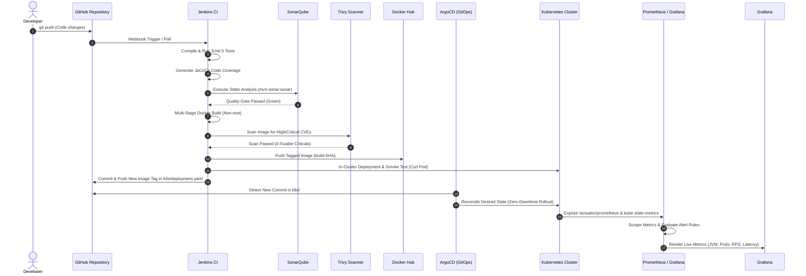

# Complete Project Architecture, Tech Stack Deep Dive & Interview Guide

This guide provides an exhaustive, technical deep dive into the **Cloud-Native DevOps & GitOps Platform on Kubernetes**. It is designed to give you complete mastery over the architecture, the technical decisions behind every tool, trade-offs against alternatives, and how to answer any senior-level DevOps / SRE interview question.

---

# Table of Contents
1. [End-to-End Architecture & Data Flow](#1-end-to-end-architecture--data-flow)
2. [Component-by-Component Tech Stack Deep Dive](#2-component-by-component-tech-stack-deep-dive)
   - [2.1 Application Layer (Java 17 & Spring Boot 3)](#21-application-layer-java-17--spring-boot-3)
   - [2.2 Containerization & Multi-Stage Dockerfile](#22-containerization--multi-stage-dockerfile)
   - [2.3 CI Orchestration (Jenkins Declarative Pipeline)](#23-ci-orchestration-jenkins-declarative-pipeline)
   - [2.4 Static Code Analysis & Quality Gates (SonarQube)](#24-static-code-analysis--quality-gates-sonarqube)
   - [2.5 Vulnerability & Security Scanning (Trivy)](#25-vulnerability--security-scanning-trivy)
   - [2.6 Container Orchestration (Kubernetes)](#26-container-orchestration-kubernetes)
   - [2.7 GitOps Continuous Delivery (ArgoCD)](#27-gitops-continuous-delivery-argocd)
   - [2.8 Full-Stack Observability (Prometheus, Grafana, Alertmanager)](#28-full-stack-observability-prometheus-grafana-alertmanager)
3. [Technology Comparison & Decision Matrix](#3-technology-comparison--decision-matrix)
4. [Critical Architecture Decisions & Trade-Offs](#4-critical-architecture-decisions--trade-offs)
5. [Exhaustive DevOps & SRE Interview Question Bank (50+ Questions)](#5-exhaustive-devops--sre-interview-question-bank)
   - [Category A: CI/CD Pipeline & Build Lifecycle](#category-a-cicd-pipeline--build-lifecycle)
   - [Category B: Docker & Container Security (DevSecOps)](#category-b-docker--container-security-devsecops)
   - [Category C: Kubernetes Architecture, Pod Lifecycle & Networking](#category-c-kubernetes-architecture-pod-lifecycle--networking)
   - [Category D: GitOps & ArgoCD Synchronization](#category-d-gitops--argocd-synchronization)
   - [Category E: Monitoring, SRE Metrics & Alerting](#category-e-monitoring-sre-metrics--alerting)
   - [Category F: Incident Response, Troubleshooting & Real-World Scenarios](#category-f-incident-response-troubleshooting--real-world-scenarios)

---

# 1. End-to-End Architecture & Data Flow



---

# 2. Component-by-Component Tech Stack Deep Dive

---

## 2.1 Application Layer: Java 17 & Spring Boot 3

### What it is & How it is Configured
- **Java 17 (LTS)**: The modern long-term support release of Java offering high performance, garbage collection enhancements (ZGC/G1), and pattern matching.
- **Spring Boot 3.x**: Industry-standard Java microservices framework.
- **Actuator & Micrometer**: Exposes production-ready operational telemetry via `/actuator/health` and `/actuator/prometheus`.
- **In-Memory Store**: Uses thread-safe `ConcurrentHashMap` for high-throughput, zero external dependency CRUD operations (`UserController` & `ProductController`).

### Alternatives Considered
1. **Node.js (Express / NestJS)**: Lightweight and event-driven, but lacks native multithreading and deep JVM-level metrics without third-party APMs.
2. **Go (Gin / Fiber)**: Extreme raw performance and tiny binary sizes, but Spring Boot is dominant in enterprise banking, healthcare, and legacy migrations.
3. **Python (FastAPI / Django)**: Rapid prototyping, but slower execution speed and higher memory per concurrent thread compared to optimized JVM runtimes.

### Why We Chose It
- Spring Boot with Micrometer provides the most realistic enterprise target for DevOps automation.
- Allows demonstrating JVM-level observability (Heap vs. Non-Heap, GC pauses, live/daemon threads, Metaspace) directly in Grafana.

---

## 2.2 Containerization: Multi-Stage Dockerfile

### What it is & How it is Configured
Located in `app/Dockerfile`:
```dockerfile
# Stage 1: Build & Package
FROM maven:3.9.9-eclipse-temurin-17 AS builder
WORKDIR /build
COPY pom.xml .
RUN mvn dependency:go-offline -B
COPY src ./src
RUN mvn clean package -DskipTests -B

# Stage 2: Minimal Production Runtime
FROM eclipse-temurin:17-jre-jammy
RUN groupadd -g 1000 spring && useradd -u 1000 -g spring -m -s /bin/bash spring
WORKDIR /app
COPY --from=builder --chown=spring:spring /build/target/*.jar app.jar
USER spring
EXPOSE 8080
HEALTHCHECK --interval=30s --timeout=5s --start-period=45s --retries=3 \
  CMD curl -f http://localhost:8080/actuator/health || exit 1
ENTRYPOINT ["java", "-jar", "app.jar"]
```

### Key Engineering Features
1. **Multi-Stage Build**: Separates the build environment (~800MB Maven + JDK) from the runtime environment (~250MB JRE-only).
2. **Layer Caching Optimization**: `pom.xml` is copied and `mvn dependency:go-offline` is executed before source code. Changing application code does **not** invalidate the heavy dependency download cache.
3. **Non-Root Execution**: Runs under explicit user `spring` (UID 1000) rather than `root` (UID 0), blocking privilege escalation attacks.
4. **Built-in Healthcheck**: Provides Docker engine-level health monitoring in addition to Kubernetes probes.

### Alternatives Considered
1. **Google Cloud Tools Jib**: Builds images directly from Maven without Docker daemon, but less transparent for beginners learning Dockerfile mechanics.
2. **Paketo / Cloud Native Buildpacks**: Automated, but abstracts away granular OS-level and user-permission configurations.
3. **Single-Stage Dockerfile**: Results in bloated 1GB+ images containing JDK compilers and Maven binaries that increase security vulnerability surface.

---

## 2.3 CI Orchestration: Jenkins Declarative Pipeline

### What it is & How it is Configured
- Managed as code in `Jenkinsfile`.
- Custom Jenkins container (`docker/jenkins.Dockerfile`) preloaded with Docker CLI, `kubectl`, Maven 3.9, and required plugins (`plugins.txt`).
- Mounts host Docker socket `/var/run/docker.sock` to build container images without running in insecure `--privileged` mode.

### 12 Automated Pipeline Stages
1. **Checkout**: Source pull and unique tag calculation: `${env.BUILD_NUMBER}-${GIT_COMMIT_SHORT}`.
2. **Build**: `mvn clean compile`.
3. **Unit Tests**: `mvn test` + surefire XML test report publication.
4. **Code Coverage**: JaCoCo analysis and HTML artifact publication.
5. **SonarQube Analysis**: `mvn sonar:sonar` static code analysis.
6. **Quality Gate**: `waitForQualityGate` blocking build on quality failures.
7. **Docker Build**: Builds tagged container image.
8. **Security Scan**: Trivy CVE scan for fixable High/Critical vulnerabilities.
9. **Push to Registry**: Docker Hub authentication and push.
10. **Deploy to Kubernetes**: Rolling update via `kubectl apply` and `kubectl rollout status`.
11. **Smoke Test**: In-cluster throwaway curl pod testing internal service DNS.
12. **Update GitOps Manifests**: Commits new image tag to Git for ArgoCD synchronization.

### Alternatives Considered
1. **GitHub Actions**: Fully managed and cloud-native, but self-hosted Jenkins allows running 100% offline without public internet webhook requirements or paid runner minutes.
2. **GitLab CI**: Excellent single-pane-of-glass UI, but heavier infrastructure footprint than standalone Jenkins.
3. **Tekton / Argo Workflows**: Kubernetes-native pipelines where every step is a Pod; steeper learning curve and higher resource overhead for a single workstation.

---

## 2.4 Static Code Analysis & Quality Gates: SonarQube

### What it is & How it is Configured
- **SonarQube 10.6 Community Edition** backed by **PostgreSQL 16**.
- Scans Java bytecode and JaCoCo XML reports.
- Enforces the **Sonar way** Quality Gate:
  - 0 Blocker / Critical Bugs
  - 0 Security Vulnerabilities
  - Code Coverage > 80% on new code
  - Duplication < 3%

### Alternatives Considered
- **Snyk Code / Checkmarx**: Proprietary, SaaS-based security scanners.
- **SpotBugs / Checkstyle**: Local linters without centralized dashboarding, historical trending, or automated pipeline gating.

---

## 2.5 Vulnerability & Security Scanning: Trivy

### What it is & How it is Configured
- Open-source vulnerability scanner developed by Aqua Security.
- Scans container OS packages (Alpine/Debian/Ubuntu) and application dependencies (Maven/npm/Go).
- Flagged with `--severity HIGH,CRITICAL --ignore-unfixed --exit-code 1` to halt builds with unmitigated high-risk vulnerabilities.

### Alternatives Considered
- **Clair / Anchore**: Powerful, but require persistent database services and daemon setup.
- **Docker Scout / Snyk**: Requires cloud account connections and subscription tiers for full CI gates.

---

## 2.6 Container Orchestration: Kubernetes

### What it is & How it is Configured
Manifests in `k8s/`:
- **Deployment**: 2 replicas, RollingUpdate (`maxSurge: 1, maxUnavailable: 0`), non-root security context.
- **Probes**:
  - `startupProbe`: `/actuator/health/liveness` (Failure threshold 12, period 5s = 60s window for JVM warmup).
  - `livenessProbe`: `/actuator/health/liveness` (Restarts pod if JVM deadlocks).
  - `readinessProbe`: `/actuator/health/readiness` (Removes pod from service endpoints if busy).
- **Service**: `ClusterIP` for cluster-internal DNS + `NodePort` (30080) for Windows localhost access.
- **ConfigMap & Secret**: Externalized configuration decoupled from immutable container images.

### Alternatives Considered
- **Docker Swarm**: Simple, but lacks ecosystem depth, custom resource definitions (CRDs), and enterprise cloud provider adoption.
- **HashiCorp Nomad**: Lightweight single-binary orchestrator, but Kubernetes is the undeniable industry standard.

---

## 2.7 GitOps Continuous Delivery: ArgoCD

### What it is & How it is Configured
- Deployed in the `argocd` namespace.
- Watches `k8s/` in the Git repository.
- Configured with `prune: true` and `selfHeal: true`.
- Continuously compares live cluster state against Git repository state. If a developer or attacker manually modifies the cluster (`kubectl edit`), ArgoCD detects configuration drift and reverts it within seconds.

### Alternatives Considered
- **Flux CD**: Powerful GitOps controller, but lacks the rich, intuitive web UI that ArgoCD provides for visual cluster state inspection.
- **Imperative CI Deployments Only (Pure Jenkins)**: Jenkins lacks continuous drift detection and cannot restore cluster state if someone modifies resources manually.

---

## 2.8 Full-Stack Observability: Prometheus, Grafana, Alertmanager

### What it is & How it is Configured
- Deployed inside Kubernetes in the `monitoring` namespace.
- **Prometheus**:
  - Scrapes Spring Boot `/actuator/prometheus` (RPS, Latency, Errors, JVM).
  - Scrapes `kube-state-metrics` (Pod status, crash loops, replica counts).
  - Scrapes `node-exporter` (Node CPU, RAM, Disk I/O).
  - Scrapes `cAdvisor` via kubelet (Container CPU & memory limits).
- **Grafana**: Auto-provisioned Prometheus datasource and multi-tier dashboard.
- **Alertmanager**: Evaluates threshold breaches (`ApplicationDown`, `HighErrorRate`, `HighLatency`, `PodRestarting`).

---

# 3. Technology Comparison & Decision Matrix

| Tool | Category | Chosen in Project | Primary Alternative | Why We Chose This Tool |
|---|---|---|---|---|
| **Spring Boot 3** | Framework | ✅ Spring Boot | Node.js / FastAPI | Rich JVM telemetry, enterprise microservice standard |
| **Temurin JRE 17** | Base Image | ✅ Temurin JRE | Alpine OpenJDK | Standard glibc compatibility, minimal JRE attack surface |
| **Jenkins** | CI Automation | ✅ Jenkins | GitHub Actions | 100% self-hosted, offline capable, no cloud bill |
| **SonarQube** | Code Quality | ✅ SonarQube CE | SonarCloud / SpotBugs | Centralized quality gate enforcement, on-premise control |
| **Trivy** | Vulnerability Scan | ✅ Trivy | Snyk / Clair | Single binary, fast scanning of OS + Java libraries |
| **Kubernetes** | Orchestration | ✅ Kubernetes | Docker Swarm | Declarative APIs, self-healing, industry standard |
| **ArgoCD** | GitOps / CD | ✅ ArgoCD | Flux CD / Spinnaker | Visual dashboard, automated drift detection and self-healing |
| **Prometheus** | Metrics Engine | ✅ Prometheus | Datadog / CloudWatch | Open-source, pull-based architecture, PromQL flexibility |
| **Grafana** | Visualization | ✅ Grafana | Kibana | Native PromQL visualizer, pre-provisioned dashboards-as-code |

---

# 4. Critical Architecture Decisions & Trade-Offs

### 1. Why GitOps (ArgoCD) Instead of Jenkins Direct Deployment?
- **Separation of Concerns**: CI (Jenkins) creates tested, immutable artifacts. CD (ArgoCD) maintains environmental state.
- **Drift Detection & Self-Healing**: If an operator manually edits a pod in production, Jenkins has no awareness. ArgoCD detects the divergence from Git and overwrites the manual change.
- **Security / Least Privilege**: Jenkins does not require cluster-admin credentials; it only needs write permissions to the Git repository.

### 2. Why Run Monitoring Inside Kubernetes Instead of Docker Compose?
- `kube-state-metrics` and `cAdvisor` require direct RBAC access to the Kubernetes API and Kubelet sockets. A Prometheus instance outside the cluster cannot query internal pod endpoints without complex networking tunnels.

### 3. Why Use Both Startup and Liveness Probes?
- Java / Spring Boot applications have a JVM warmup phase (JIT compilation, Spring context initialization) that can take 30–60 seconds.
- Without a `startupProbe`, an aggressive `livenessProbe` would fail during initialization and kill the pod in a perpetual crash loop before it ever becomes healthy.

---

# 5. Exhaustive DevOps & SRE Interview Question Bank

---

## Category A: CI/CD Pipeline & Build Lifecycle

#### Q1: What is the exact difference between Continuous Integration, Continuous Delivery, and Continuous Deployment?
- **Continuous Integration (CI)**: Developers merge code changes frequently into a shared repository. Every merge triggers automated builds, unit tests, code coverage, and static analysis to detect integration issues immediately.
- **Continuous Delivery (CD)**: Extends CI by automatically packaging and deploying passing builds into staging/production-ready environments. Actual promotion to production requires a manual approval gate.
- **Continuous Deployment**: Completely eliminates manual approval gates; every change that passes all pipeline stages is automatically deployed directly to production. This project implements **Continuous Deployment** via ArgoCD automated sync.

#### Q2: How does the pipeline generate unique, immutable container image tags?
- We avoid mutable tags like `:latest` in production deployments.
- In the `Jenkinsfile`, we compute:
  ```groovy
  IMAGE_TAG = "${env.BUILD_NUMBER}-${env.GIT_COMMIT.take(7)}"
  ```
- This guarantees full traceability from a running pod in Kubernetes back to the exact Git commit SHA and Jenkins build run that produced it.

#### Q3: What happens if a unit test fails or the SonarQube quality gate fails?
- The Jenkins pipeline immediately halts execution (`currentBuild.result = 'FAILURE'`).
- Downstream stages (Docker build, Trivy scan, Kubernetes deployment) are never executed, preventing defective or unvetted code from reaching any registry or cluster.

#### Q4: Why is it bad practice to store secrets inside Jenkinsfile or Git? How does this project handle secrets?
- Committing secrets to Git exposes credentials to anyone with repository read access.
- In this project, Jenkins retrieves all credentials (Docker Hub, SonarQube token, GitHub PAT) at runtime using `withCredentials()` blocks from the encrypted Jenkins Credentials Store. Secrets are never printed in console logs or written to disk.

---

## Category B: Docker & Container Security (DevSecOps)

#### Q5: What is a Docker multi-stage build, and what are its key benefits?
- A multi-stage build uses multiple `FROM` instructions in a single `Dockerfile`.
- In our project, Stage 1 uses `maven:3.9.9-eclipse-temurin-17` to compile the Java code. Stage 2 uses `eclipse-temurin:17-jre-jammy` and copies **only** the resulting `.jar` file.
- **Benefits**:
  1. Shrinks image size from ~850MB to ~250MB.
  2. Eliminates build tools (compilers, Maven, package managers) from runtime, drastically reducing CVE attack vectors.

#### Q6: Why is running containers as the `root` user dangerous, and how did you prevent it?
- By default, container processes run as `root` (UID 0). If an application vulnerability allows Remote Code Execution (RCE) or a container breakout, the attacker gains root-level access on the host.
- In our `Dockerfile`, we create a dedicated user:
  ```dockerfile
  RUN groupadd -g 1000 spring && useradd -u 1000 -g spring spring
  USER spring
  ```
- In `k8s/deployment.yaml`, we enforce this policy:
  ```yaml
  securityContext:
    runAsNonRoot: true
    runAsUser: 1000
  ```

#### Q7: How does Trivy integrate into the CI/CD pipeline, and what is its pass/fail criteria?
- Trivy scans the locally built image before it is pushed to Docker Hub.
- The command:
  ```bash
  trivy image --severity HIGH,CRITICAL --ignore-unfixed --exit-code 1 devops-demo:tag
  ```
- If any fixable `HIGH` or `CRITICAL` vulnerability is detected in either OS packages or Java libraries, Trivy exits with code `1`, causing Jenkins to fail the pipeline.

---

## Category C: Kubernetes Architecture, Pod Lifecycle & Networking

#### Q8: What is the difference between `startupProbe`, `livenessProbe`, and `readinessProbe`?
- **`startupProbe`**: Determines whether the application has started. All other probes are disabled until this succeeds. Protects slow-starting applications (like JVMs) from being killed prematurely.
- **`livenessProbe`**: Checks if the container is healthy and running. If it fails, Kubernetes kills the pod and restarts a new container according to its restart policy.
- **`readinessProbe`**: Checks if the container is ready to accept incoming traffic. If it fails, the pod is temporarily removed from the Kubernetes Service endpoints, stopping traffic routing without restarting the container.

#### Q9: How does Kubernetes achieve zero-downtime deployments during updates?
- We configure a `RollingUpdate` strategy in `k8s/deployment.yaml`:
  ```yaml
  strategy:
    type: RollingUpdate
    rollingUpdate:
      maxSurge: 1
      maxUnavailable: 0
  ```
- `maxUnavailable: 0` ensures Kubernetes never terminates an existing healthy pod until a new pod passes its `readinessProbe`.
- `maxSurge: 1` allows Kubernetes to spin up 1 temporary extra pod above the replica count during the transition.

#### Q10: What is the difference between `ClusterIP`, `NodePort`, and `LoadBalancer` Services?
- **ClusterIP**: Exposes the service on a cluster-internal IP. Reachable only within the Kubernetes cluster.
- **NodePort**: Exposes the service on each Node's IP at a static port (in range 30000–32767). Allows external traffic to hit `<NodeIP>:<NodePort>`.
- **LoadBalancer**: Integrates with cloud providers (AWS, GCP, Azure) to provision an external hardware/software cloud load balancer (e.g., AWS NLB/ALB).

#### Q11: What are Kubernetes resource `requests` vs `limits`? What happens when a container exceeds them?
- **`requests`**: The minimum guaranteed CPU and Memory Kubernetes guarantees when scheduling a Pod onto a node.
- **`limits`**: The hard ceiling of resources a container is permitted to consume.
  - If a container exceeds its **CPU limit**, Kubernetes throttles the CPU (application runs slower, but is not killed).
  - If a container exceeds its **Memory limit**, the Linux kernel Out-Of-Memory (OOM) Killer terminates the container with `OOMKilled` (Exit Code 137).

---

## Category D: GitOps & ArgoCD Synchronization

#### Q12: What is GitOps, and what are its core principles?
1. **Declarative Descriptions**: The entire system is described declaratively (YAML manifests).
2. **Git as Single Source of Truth**: Desired system state is stored in Git.
3. **Automated State Application**: Approved changes in Git are automatically pulled and applied.
4. **Continuous State Reconciliation**: Software agents (ArgoCD) continuously observe live state and reconcile differences.

#### Q13: What is "Configuration Drift" and how does ArgoCD resolve it?
- Configuration drift happens when someone makes manual, uncommitted changes to the cluster (e.g., `kubectl edit deployment devops-demo --replicas=5`).
- With `selfHeal: true`, ArgoCD's reconciliation loop compares the live state with the Git repository every few seconds, detects the discrepancy, and immediately reverts the live cluster back to match Git.

#### Q14: Why do we update the Git manifest in Jenkins rather than applying directly to Kubernetes?
- If Jenkins runs `kubectl apply`, Git no longer reflects the true state of what is deployed in production, breaking the GitOps audit trail.
- By having Jenkins commit the new image tag to `k8s/deployment.yaml` in Git, anyone inspecting the Git repository can immediately see the exact version currently deployed in production.

---

## Category E: Monitoring, SRE Metrics & Alerting

#### Q15: What are the Four Golden Signals of Monitoring (Google SRE)? How does this project monitor them?
1. **Latency**: Time taken to service a request. Monitored via Spring Boot Micrometer `http_server_requests_seconds_duration`.
2. **Traffic**: Demand placed on the system (Requests Per Second). Monitored via `rate(http_server_requests_seconds_count[1m])`.
3. **Errors**: Rate of requests that fail (HTTP 5xx). Monitored via `rate(http_server_requests_seconds_count{status=~"5.."}[5m])`.
4. **Saturation**: How "full" the service is (CPU, Memory, JVM Heap). Monitored via `jvm_memory_used_bytes` and cAdvisor container limits.

#### Q16: What is the difference between Prometheus and Grafana?
- **Prometheus** is a time-series database and metric collection engine. It actively scrapes HTTP endpoints, stores numeric metrics, and evaluates PromQL alert expressions.
- **Grafana** is a data visualization and dashboarding platform. It queries Prometheus via PromQL to render visual graphs, bar charts, and operational dashboards.

#### Q17: What is `kube-state-metrics` and why is it needed alongside Prometheus?
- Prometheus scrapes raw time-series metrics. It does not understand Kubernetes object structures natively.
- `kube-state-metrics` listens to the Kubernetes API server and generates metrics about the health of objects (Deployments, Pods, Nodes, persistent volumes), such as `kube_pod_status_phase`, `kube_pod_container_status_restarts_total`, and `kube_deployment_status_replicas_available`.

---

## Category F: Incident Response, Troubleshooting & Real-World Scenarios

#### Q18: A Pod is stuck in `CrashLoopBackOff`. How do you troubleshoot and fix it?
1. **Inspect Pod Status and Events**:
   ```bash
   kubectl describe pod <pod-name> -n devops-demo
   ```
   Check the `Events:` section at the bottom for exit codes (e.g., OOMKilled, failed health checks, missing ConfigMap keys).
2. **Check Logs of the Crashed Container**:
   ```bash
   kubectl logs <pod-name> -n devops-demo --previous
   ```
   The `--previous` flag fetches logs from the container instance right before it died.
3. **Common Causes**:
   - Application thrown exception / missing database connection.
   - OOMKilled: Increase memory limit in `k8s/deployment.yaml`.
   - Aggressive liveness probe: Increase `initialDelaySeconds` or adjust `startupProbe`.

#### Q19: A Pod is in `ImagePullBackOff` or `ErrImagePull`. What are the steps to diagnose?
1. Run `kubectl describe pod <pod-name> -n devops-demo` and inspect the `Events` log.
2. Verify the exact image name and tag in `k8s/deployment.yaml`.
3. For private registries, verify that `imagePullSecrets` is configured in the pod spec.
4. For local clusters (Docker Desktop / Minikube), verify `imagePullPolicy: IfNotPresent` is set so Kubernetes does not attempt to pull locally built images from the public internet.

#### Q20: How would you scale this pipeline and cluster from a local demo to a multi-region AWS EKS production environment?
1. **Infrastructure as Code (IaC)**: Use Terraform to provision multi-region Amazon EKS clusters, VPCs, and IAM roles.
2. **Registry**: Replace Docker Hub with Amazon ECR with AWS KMS encryption and vulnerability scanning.
3. **Ingress & TLS**: Deploy AWS Load Balancer Controller with AWS Certificate Manager (ACM) for automatic HTTPS termination.
4. **Secret Management**: Integrate External Secrets Operator (ESO) syncing secrets from AWS Secrets Manager or HashiCorp Vault.
5. **Observability**: Scale Prometheus with Amazon Managed Service for Prometheus (AMP) and Amazon Managed Grafana (AMG), storing long-term metrics in S3 with Thanos/Cortex.
